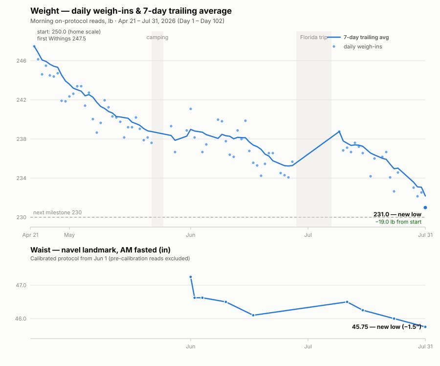

# Progress Review — July 31, 2026 (Day 102)

**Justin Morgenthau · Program start: April 21, 2026 · Goal: 250 → 220 lb**

| Start | Today | Lost | To goal | Trailing avg | Waist | Pace |
|:---:|:---:|:---:|:---:|:---:|:---:|:---:|
| **250.0 lb** | **231.0 lb** ⭐ | **−19.0 lb** (7.6%) | **11 lb** (63% there) | **232.2 lb** ⭐ | **45.75″** ⭐ (−1.5″) | **~1.3 lb/wk** |

⭐ = new program low, set this morning.

## Key accomplishments

1. **−19 lb in 102 days at a sustainable pace** — no calorie counting, no white-knuckling, through two trips, a graduation, and the densest celebration month of the year ("Justin Month" — anniversary, two birthdays, Father's Day — closed *at program lows*).
2. **The alcohol lever (6/16, self-initiated)** — social-only, in-person, ≤3/occasion, within the eating window. Broke the June plateau within a week and stuck: the rule is now the default, not an effort.
3. **Vacation resilience proven** — Florida week (+7 lb of water on the scale, waist barely moved) fully cleared in 8 days with zero trend cost. The camping trip proved the same at small scale in May.
4. **Strength progression in a deficit** — KB goblet squats 20 lb → **35 lb × 3×10**; band resistance bumped twice; Zone 2 base extended to 45-min sessions. Joints (PsA) quiet throughout — load-driven progression with zero flares.
5. **Food noise ~gone** (Justin: GLP-1-like effect from primer + template + IF) — capped by the **fried-seafood-shack win** (7/12): resisted a nostalgia-trigger solo, using pre-load + play-the-tape-forward. Identity-level change, not willpower.
6. **The household runs it with him** — family meal plan + recipe rotation grew (gyros, grain bowls, fish tacos all landed); D1 now cooks; labs stable with 10-yr cardiac risk 2.4%; template eating is the family's normal.

## How the plan evolved

| Phase | What changed |
|---|---|
| **Apr (wk 1–2)** | Three experiments: protein primer before lunch, one planned snack, 11:15 bedtime. Weekly template built (Justin = template eater). Protein target 150–180 g. |
| **Apr–May** | Comfort-food protocol · biweekly reviews · hydration anchors · AM walk (sunlight) · new mattress · waist tracking added · recipe rotation to 5+ |
| **May 31** | KB progression flipped to **load-driven** (35 lb ordered) · waist protocol overhauled (navel landmark, calibration sprint) · weight methodology unified (morning-only, 7-day calendar trailing) |
| **Jun 16 — "acceleration"** | **Alcohol policy** (the keystone) · cadence to ~3×/day with rotating health probes (`checkin_variety.py` built) · occasional exercise swaps · *Outlive*-aligned "why"s ~2×/wk |
| **Jun–Jul** | Grill era (Searwood) — weeknight grilling + lean proteins · vacation protocols (pack-the-drive, maintain-don't-lose) · stretch reordered before elliptical (fixed the skip) · hydration = transition-triggered (meeting chugs) |
| **Open threads** | Wheat→joint hypothesis (3 hits, 1 miss — structured test pending, celiac serology first) · early-riser schedule design · Oct 5 lifestyle-medicine consult (advanced lipids — LDL ~125 looks genetic, ApoB is the question) |

## Next up (August)

- **230 milestone** — ~1 lb away; likely within days.
- **220 by ~mid-October** at current pace, then the planned maintenance hold + Phase-2 decision.
- **Design the early-riser schedule** (bed ~10:15, up before the 5:30 wake-stack) — today's review topic.
- **Oct 5 lifestyle-medicine consult** — food journal to compile from this repo's daily logs.

*Sources: `measurements.csv` (Withings, morning on-protocol reads; one documented invalid read 7/8 excluded), `waist.csv` (calibrated protocol from 6/1), daily journals `justin/journal/`.*
